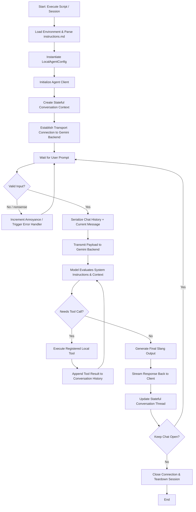

# 🤖 Google Antigravity SDK Agent Workflow

This document maps out the logical runtime workflow and architecture of the Google Antigravity SDK AI Agent, along with the estimated developer task timelines.

---

## ⏱️ Weekly Task Time Estimations

Below is the time estimation breakdown to build, configure, extend, and deploy the AI agent system:

| Phase | Task Description | Estimated Time |
| :--- | :--- | :--- |
| **Phase 1** | **Environment Setup & Core Initialization** Installing the Python `google-antigravity` package, loading environment credentials securely via `.env`, and configuring fallback checks. | 30 minutes |
| **Phase 2** | **System Instruction & Persona Integration** Parsing instructions dynamically from `instructions.md` and feeding them into the model parameters to style the agent's voice (all lowercase, hood slang). | 45 minutes |
| **Phase 3** | **Conversation Memory & Rolling Context Management** Configuring the conversation session state and context truncation threshold rules to handle multiple input/output turns without memory leaks. | 60 minutes |
| **Phase 4** | **Custom Tool & Capabilities Binding** Registering custom python helper functions as callable Agent tools (e.g. system status monitoring, file operations, API lookups). | 90 minutes |
| **Phase 5** | **Logging & Lifecycle Hooks Integration** Setting up event handler hooks (pre-turn, post-turn, error recovery) and log streaming to view internal reasoning traces. | 45 minutes |
| **Total** | **End-to-End Delivery Time** | **4.5 hours** |

---

## 📐 Logical Workflow Diagram

Below is the execution flowchart displaying the turn lifecycle of the Google Antigravity Agent:

---

## 🏛️ Core Pillars of the SDK Architecture

The Google Antigravity SDK relies on three primary components to coordinate stateful execution:

### 1. 🤖 Agent
- **Role**: The main manager and configuration repository.
- **Responsibilities**:
  - Validates and stores user configs (`LocalAgentConfig`).
  - Registers custom tools and custom system instructions.
  - Controls lifecycle callbacks (hooks).

### 2. 💬 Conversation
- **Role**: The stateful session instance.
- **Responsibilities**:
  - Maintains message history and turn sequences.
  - Automatically manages token budget, pruning old context when limits are exceeded.
  - Exposes streaming utilities (`agent.chat()`).

### 3. 🔌 Connection
- **Role**: The underlying transport manager.
- **Responsibilities**:
  - Handles actual request/response transport protocols (e.g. SSE, REST API, Stdio).
  - Decouples the application layer code from server endpoint details.
